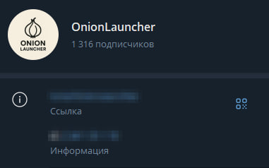
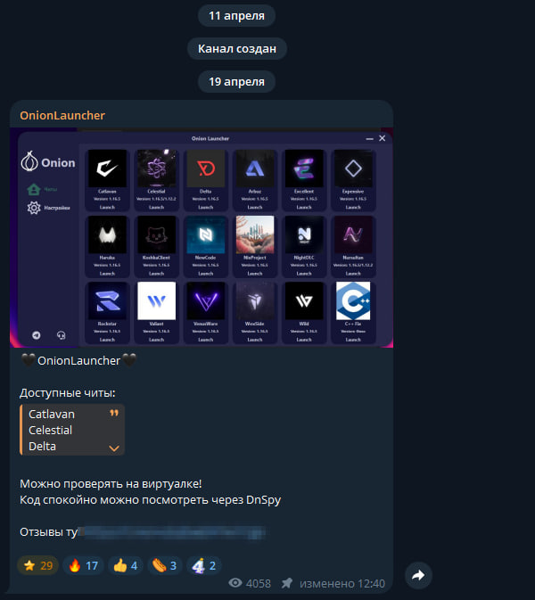
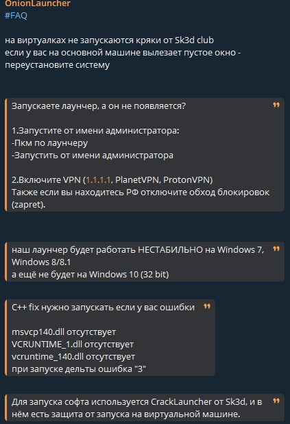
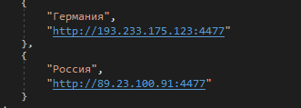
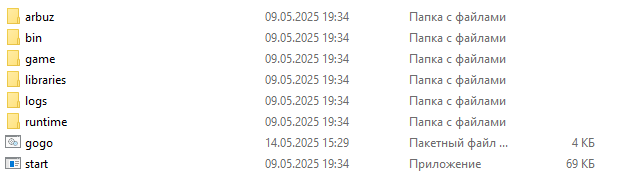
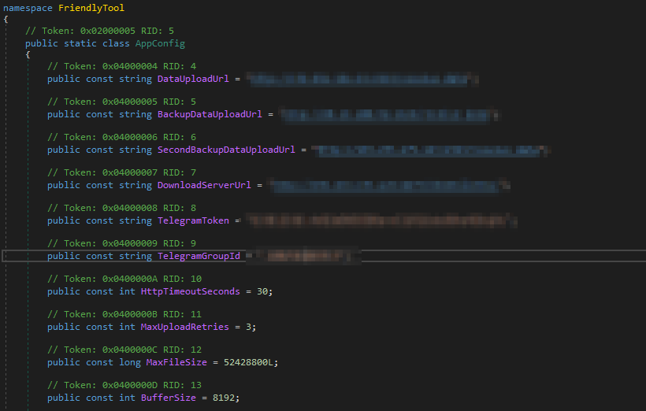
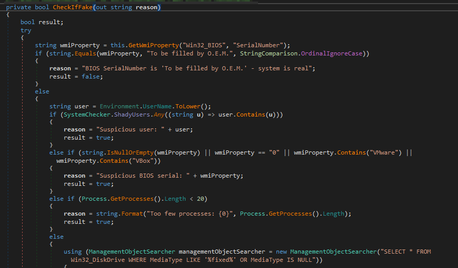

# Onion Launcher: как CouitaSecurity провела масштабное исследование и отслеживала злоумышленников

## Анализ канала

Канал насчитывает более **1300 подписчиков**.  
На аватаре канала присутствует **логотип с названием и изображением луковицы**.  
**Описание канала отсутствует.**

## Переходим к постам

Канал начинает свою активность с **19 апреля** (на момент расследования).

В канале размещена **"Инструкция"** по устранению неполадок, кратко рассмотрим её далее:

Инструкция **не содержит ничего подозрительного** или вызывающего внимание.

## Ладно-ладно, если вы ничего не заметили...

В инструкции указано следующее:

> **"Для запуска софта используется CrackLauncher от Sk3d, и в нём есть защита от запуска на виртуальной машине."**

**Исследователь:** Скажем так — программа **спокойно работает в виртуальной машине** без каких-либо проблем.

🎯 Самое интересное — **впереди!**

## Исследование — Лаунчер

Загружаем версию **2.0.0.0** и приступаем к изучению его устройства, сравнивая поведение с предоставленными исходниками.

---

⛔ **Стоп-стоп... Точно!**  
Исходный код был **получен в ходе расследования, отслеживания и общения со злоумышленниками**. Эти исходники окажутся крайне полезными для дальнейшего анализа.

---

**Исследователь:** Насколько же **неопытным оказался разработчик лаунчера**, раз без каких-либо сомнений **передал исходники**.

# Лаунчер

В ходе исследования используется программа [dnSpy](https://github.com/dnSpy/dnSpy) —  
> **dnSpy** is a debugger and .NET assembly editor. You can use it to edit and debug assemblies even if you don't have any source code available.

---

Лаунчер написан на **C# с использованием WinForms** и **библиотеки GunaUI2**.

**Исследователь:** Скажем сразу — **структура кода и комментарии указывают на то, что лаунчер написан с помощью ИИ** (высока вероятность использования ChatGPT или аналогичных инструментов).

---

### Класс с темами

В коде определены **шесть цветовых тем**:

- Тёмно-серый  
- Тёмно-серый (ещё темнее)  
- Белый  
- Оттенок зелёного  
- Светло-коричневый  
- Тёмно-серый (повторяется)

### Класс с серверами

В классе **`ServerSettings`** указаны два сервера:

- **"Германия"** - `http://193.233.175.123:4477`  
- **"Россия"** - `http://89.23.100.91:4477`

Эти адреса используются для **загрузки вредоносных элементов** в процессе работы лаунчера.

### Класс ClientLoader

Именно в этом классе реализованы следующие компоненты:

- **Радио**
- **Игры**
- **Главный функционал — загрузка вредоносных компонентов**

📌 Первые два элемента (радио и игры) были добавлены, вероятно:

- Для **развлечения пользователя**  
- Либо с целью **искусственно увеличить объём кода** и **нагрузку на систему**, затрудняя анализ

**Исследователь:** Возможна также попытка отвлечь внимание от основного вредоносного поведения.

## Загрузка читов

Программа загружает архив с выбранным читом (который выбрал пользователь).

Внутри архива находятся файлы:

- `start.exe` — запуск чита.  
- `gogo.bat` — вредоносный скрипт от злоумышленников.

---

## Отправка файла на AnyRun

Ниже приведены результаты анализа и краткий отчёт по поведению скрипта:

### Злонамеренные (MALICIOUS):

- Несколько экземпляров PowerShell запускаются в **скрытом режиме**.  
- Через `cmd.exe` изменяются параметры Windows Defender:  
  - Добавляется исключение по пути.  
  - Добавляется исключение по расширению.

### Подозрительные (SUSPICIOUS):

- Запуск приложения с необычным расширением.  
- Использование `PING.EXE` для задержки выполнения (приём уклонения от анализа).  
- Запуск PowerShell через `cmd.exe` для выполнения команд.  
- Применение PowerShell-задержек (например, `Start-Sleep`) — признак уклонения от анализа.  
- Использование `ATTRIB.EXE` для изменения атрибутов файлов.  
- Скрипт добавляет исключения в Windows Defender.

### Информационные (INFO):

- Изменение отображения символов в консоли.  
- Ручной запуск пользователем.  
- Проверка кодировки через `chcp.com`.  
- Множество PowerShell-процессов проверяют словари и вызывают исключения.  
- Использование `curl.exe` для сетевых операций и создания файлов во временной папке.

Скрипт загрузил файл `Crack224885939_5089.exe` (имя сгенерировано с помощью функции `Get-Random`).

После запуска файл `Crack224885939_5089.exe` **ничего не выполняет**, как позже выяснилось — из-за встроенной защиты.

Поэтому мы возвращаемся к анализу с помощью `dnSpy`.

## Анализ исполняемого файла

Вирус написан на **C#** и содержит защиту от анализа (**Anti-VM**),  
однако она **не стала серьёзным препятствием** для исследования.

С помощью `dnSpy` в классе `AppConfig` были найдены **полностью открытые параметры вируса**:

---

По полученному **Telegram-токену бота** появилась возможность **отправлять сообщения напрямую злоумышленникам**.

---

## Благодарности

💬 Особую благодарность выражаем **поддержке сайта [Play2Go]**,  
которая **оперативно отреагировала и заблокировала сервера злоумышленников**.

❗ К сожалению, **другой сервис** (название мы не указываем)  
**отказался блокировать сервера**, и **на момент написания отчёта они всё ещё активны** —  
**никаких изменений не произведено**, несмотря на предоставленные доказательства.

## Продолжение анализа

### Класс `ScreenGrabber`

По самому названию класса становится ясно, что он отвечает за **создание скриншота экрана**.  
Анализ показал, что **никакой другой функциональности** в этом классе не реализовано.

---

### Класс `SystemChecker` и метод `CheckIfFake`

В классе `SystemChecker` реализован метод `CheckIfFake`, который отвечает за  
**проверку на наличие вируса в виртуальной среде или песочнице**.

Метод включает в себя:

- Проверку параметров системы;
- Проверку имени компьютера и пользователя;
- **Анализ оборудования**, включая производителя и модель;
- **Проверку объёма оперативной памяти** — если объём подозрительно мал, это может указывать на VM.

📌 Все эти меры направлены на **уклонение от анализа и запуска в безопасной среде**.

## Класс `FileFinder`

В этом классе реализован **поиск файлов в системе**.  
Однако вирус **пропускает папки**, которые либо не представляют интереса, либо **могут создать избыточную нагрузку**,  
что говорит о стремлении к «тихому» и эффективному заражению.

---

## Поведение вируса

Вирус передаёт данные на **удалённый сервер** или **бота в Telegram** и сообщает:

- О факте заражения;
- О ходе выполнения этапов заражения.

---

## Класс `FileDownloader`

В классе `FileDownloader` обнаружен **URL-адрес сервера** и список файлов, подлежащих загрузке:

- `Miner.exe`
- `Rat.exe`

---

## 🧪 Анализ `Miner.exe`

### Злонамеренные (MALICIOUS)

**`Miner.exe` и `GoogleUpdater.exe`:**

- Изменяют настройки **Windows Defender**.
- Добавляют **исключения по расширению файлов**.

**`cmd.exe`:**

- Удаляет **средство удаления вредоносных программ** (MRT).
- Фиксируется **маскировка XMRIG** (по YARA-правилам).

**`GoogleUpdater.exe`:**

- Использует **уязвимый драйвер** для эскалации привилегий.

**`svchost.exe`:**

- Активность **криптомайнинга** зафиксирована (SURICATA-детекция).

---

### Подозрительные (SUSPICIOUS)

**`Miner.exe` и `GoogleUpdater.exe`:**

- Запускают `PowerShell`, `cmd.exe`, `sc.exe`, меняют переменные среды.
- Добавляют исключения в защитник Windows.
- Управляют службами (`sc.exe` — создание/остановка).
- Изменяют параметры электропитания (`powercfg.exe`).

**`wusa.exe`:**

- Удаляет обновления Windows.

**`cmd.exe`:**

- Подключение к нестандартному порту.

---

### Информационные (INFO)

- Обнаружены **PowerShell-исключения и проверки ключей реестра**.
- Создание файлов в директории запуска.
- Обнаружена **упаковка UPX**.
- Языки компиляции: **английский и японский**.

---

## 🧪 Анализ `Rat.exe` (Remote Access Trojan)

### Общая характеристика

`Rat.exe` — это **удалённый доступ** с широкими возможностями управления заражённой машиной.

### Ключевые техники:

- Использует **WMI через .NET** для удалённого исполнения команд.
- Применяет **рефлексивную загрузку .NET-ассамблей** (исполнение кода из памяти).
- Команды и данные **кодируются в Base64** для сокрытия.

---

### Сокрытие присутствия:

- Изменение атрибутов файлов (скрытие).
- Модификация и удаление ключей реестра для устранения следов.

---

### Разведка и сбор данных:

- Сбор имени пользователя, прав, списка аккаунтов, имени хоста, числа процессоров.
- Обход файловой системы, проверка каталогов и ключей реестра.
- **Скриншоты экрана пользователя**.

---

### Угрозы и возможности:

- Полный контроль над системой.
- Запуск произвольных команд.
- Загрузка и выполнение модулей.
- Кража файлов.
- Взаимодействие с C2 (сервером управления).
- Отключение защитных механизмов.
- Изменение системных параметров.

---

⚠️ **RAT представляет собой критическую угрозу безопасности,  
обеспечивая злоумышленнику постоянный, скрытый и гибкий контроль над системой.**

## 🛡️ Рекомендации после заражения

1. **Проведите антивирусную проверку.**  
   Используйте надежный сканер, например:  
   [Kaspersky Virus Removal Tool (KVRT)](https://www.kaspersky.ru/downloads/thank-you/free-virus-removal-tool) — он выявляет и удаляет угрозы без установки антивируса.

2. **После очистки** обязательно:
   - Обратитесь в [Клуб Касперского](https://forum.kasperskyclub.ru/) или  
     [Форум Лаборатории Касперского](https://forum.kaspersky.com/)  
     для получения **индивидуальной помощи**, удаления остаточных следов и восстановления **системных параметров**.

3. **Удалите сохранённые пароли и карты** из браузеров:
   - Не используйте встроенные менеджеры в Chrome, Edge, Firefox и других браузерах;
   - Замените их на **отдельный менеджер паролей** (например: Bitwarden, KeePass, 1Password).

4. **Измените пароли** ко всем важным аккаунтам:
   - Особенно к email, банковским сервисам, соцсетям и аккаунтам разработчиков (GitHub, Discord и др.).

5. **Проверьте автозагрузку и планировщик задач:**
   - Удалите подозрительные записи, скрипты и исполняемые файлы, оставшиеся после заражения.

6. **Переустановите систему**, если есть признаки глубокой компрометации (например, при наличии rootkit-драйверов, нестандартных служб и постоянной повторной загрузки вредоносных компонентов).

> ⚠️ **Важно:** Даже после удаления вируса, злоумышленник может обладать уже украденными данными.
